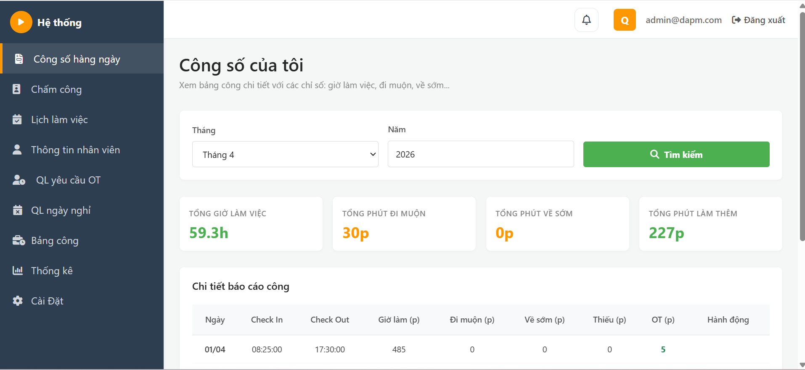
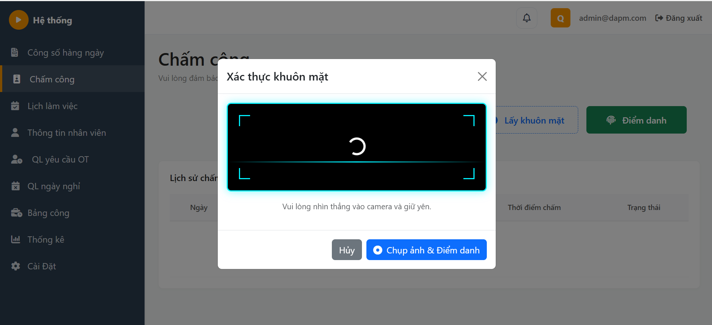
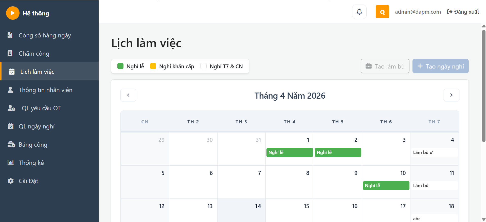
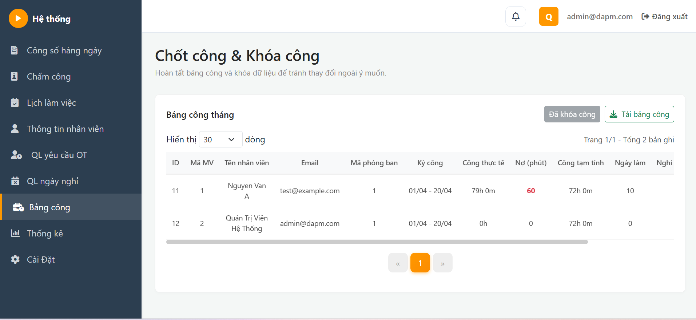
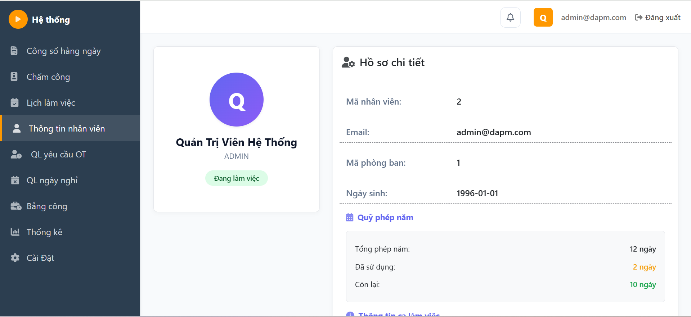
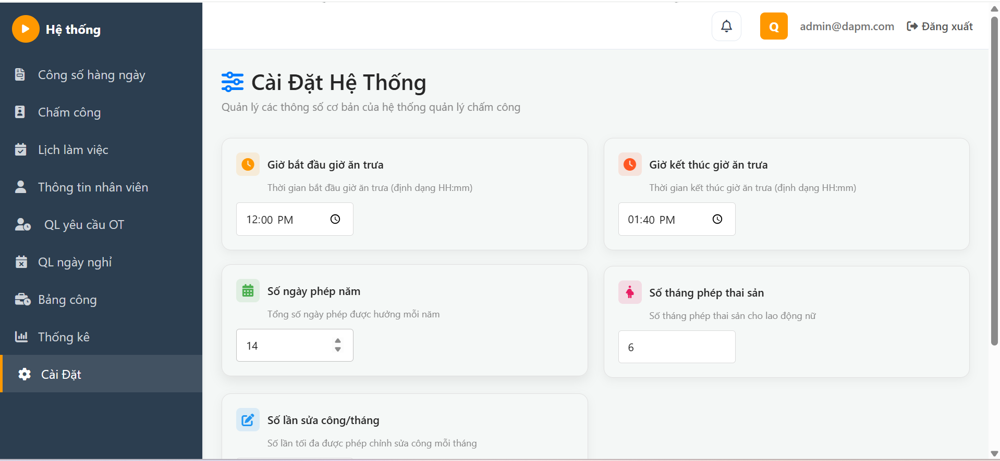

# 📋 Hệ Thống Tính công ( Không bao gồm nghiệp vụ tính lương)
Hệ thống tính công nhân sự cho các doanh nghiệp, hỗ trợ chấm công qua nhận dạng khuôn mặt, quản lý giờ làm thêm, tính công số, và báo cáo, tuân thủ lao động theo quy định Việt Nam.

---

**Contributors**:
- Trần Việt Anh (Leader) - Backend + BA
- Trịnh Đắc Vụ - Devops
- Nguyễn Quang Huy - Frontend + BA
- Nguyễn Viết Bình Dương - Tester

> Thời gian: 15/2/2026 - 15/4/2026

## ⚖️ Business Logic

### 1. Chấm công & Chốt công

- Hệ thống cho phép chấm công bằng cách nhận diện khuôn mặt.

- Chốt công sẽ xảy ra random trong các ngày 18-20, (chốt công sớm để kịp chuyển lương vào mùng 1 tháng sau). Sau ngày chốt công, công số mặc định tạm tính đủ. Điều đó có nghĩa là từ ngày chốt công - cuối tháng, nếu có phát sinh đi muộn về sớm, thì sẽ bị trừ sang công số tháng sau.

- Ví dụ: ngày 18 chốt công, `ngày 1 đến 17` tính công thực tế, `ngày 18 đến 30` sẽ tạm tính đủ công ( 8 tiếng/ 1 ngày). Sau ngày chốt công, anh A nghỉ 1 ngày không phép vào ngày 25. Anh A sẽ bị trừ đi 8 tiếng ở `lần chốt công tháng sau`.

- Khi quên chấm công hoặc chấm công lỗi, nhân viên có thể tạo `yêu cầu sửa chấm công`, sau khi yêu cầu được duyệt. Công số bị thiếu của người đó ngày hôm đó sẽ được tính đủ. 1 tháng được tạo yêu cầu 3 lần. Nếu kì công đã **bị khóa** thì không cho phép sửa chấm công

### 2. Về thời gian OT

- Thời gian làm thêm (OT) cần tuân thủ quy định pháp luật: 1 ngày không làm > 12 tiếng (OT + 8 tiếng), 1 tháng không làm > 40 tiếng, 1 năm không làm > 200 tiếng. Khi vượt quá, yêu cầu làm thêm bị từ chối tự động.
- Làm thêm ngày thường: x1.5 lương, làm thêm ngày cuối tuần: x2 lương, làm thêm vào ngày nghỉ lễ: x3 lương ( Hệ thống tính công chỉ thống kê lại)

### 3. Cấu hình
- Có 2 ca làm việc chính thức: 8h30 - 17h30, 9h00 - 18h00, khi nhân viên đổi ca làm việc thì ca làm việc mới sẽ được áp dụng kể từ tháng sau
- Nghỉ trưa 1 tiếng, cố định từ 12h00 - 13h00, thời gian nghỉ trưa không được tính vào thời gian làm việc
- 1 tuần làm việc 5 ngày, nghỉ thứ 7, chủ nhật, nghỉ lễ hàng năm
- Cho phép tạo ngày nghỉ nếu thời tiết xấu và làm bù vào thứ 7, chủ nhật vào tuần này

### 4. Nghỉ phép
- Nhân viên được nghỉ 14 ngày phép full lương 1 năm. Các ngày nghỉ như hiếu, hỉ sẽ được nghỉ 3 ngày (không tính vào ngày 14 ngày nghỉ phép)
- Số ngày nghỉ phép dôi ra của năm nay sẽ được cộng dồn sang năm sau: ví dụ như sau: năm 1 chỉ nghỉ 10 ngày, còn dư 4 ngày nghỉ phép, 4 ngày nghỉ phép này sẽ được cộng sang năm thứ 2 ( 4 + 14 = 18 ngày).
- Số ngày nghỉ phép chỉ cho cộng dồn 1 năm. Sang năm thứ 3 sẽ bị hủy bỏ.

### 5. Quyền lợi nhân viên

- Vào ngày sinh nhật nhân viên sẽ được tặng miễn phí một ngày công. Người đó có thể đi làm hoặc nghỉ ngày hôm đó, nếu đi làm vẫn tính công bình thường.

### 6. Thống kê

- Thống kê nhân viên chăm chỉ để phục vụ trao giải, thống kê đi muộn/về sớm, ...

## Tài liệu: 
`Link tài liệu `: https://drive.google.com/drive/folders/1r73PrdrbW8qOGboR3U7YgjpPmCUKjR-B?usp=drive_link
`Defect log`: <a href="https://humgedu-my.sharepoint.com/:x:/g/personal/2221050047_student_humg_edu_vn/IQBMpk5FZKVCQ7DmC_SdBLYVAXV7IRQf4RxqRwy3sfrNlkg?e=SNZd72">Here</a>

## Yêu cầu phi chức năng
- Dữ liệu phải có độ tin cậy cao, dù nhân viên có yêu cầu sửa công được chấp nhận thì log ngày hôm đó vẫn được giữ nguyên
- Dữ liệu phải tồn tại > 5 năm, có thể backup, có thể tracking ai thực hiện hành động
- Nhân viên có quyền phù hợp, idempotency
- Phát hiện bất thường: ở lại công ty quá muộn, nghỉ liên tục nhiều ngày, ...

## Yêu cầu chức năng

### 1. **Chấm Công & Điểm Danh**
- Chấm công qua nhận dạng khuôn mặt (Face Recognition)
- Tính toán giờ làm việc tự động dựa trên log chấm công
- Báo cáo chấm công chi tiết theo ngày/tháng
- Sửa chữa dữ liệu chấm công lỗi

### 2. **Quản Lý Ca Làm Việc**
- Đổi ca làm việc linh hoạt
- Phát hiện chấm công trễ sau 10h tối

### 3. **Quản Lý Giờ Làm Thêm (Overtime)**
- Tạo yêu cầu làm thêm giờ
- Duyệt/từ chối yêu cầu làm thêm
- Tính lương theo hệ số (x1, x1.5, x2) dựa trên ngày tăng ca
- Báo cáo giờ làm thêm theo nhân viên

### 4. **Quản Lý Ngày Nghỉ**
- Yêu cầu ngày nghỉ phép
- Quản lý ngày nghỉ không lương
- Theo dõi hành động của nhân viên

### 5. **Tính công & Báo cáo**
- Tính công tự động dựa trên log chấm công
- Báo cáo công chi tiết
- Xuất báo cáo ra Excel
- Theo dõi phúc lợi nhân viên

### 6. **Quản Lý Hệ Thống**
- Cài đặt các thông số hệ thống
- Xác thực người dùng
- Quản lý lịch làm việc: nghỉ lễ, nghỉ phép

---

## 🛠️ Công Nghệ Sử Dụng

### 1. Backend
| Công Nghệ | Mục Đích |
|-----------|---------|
| **FastAPI**  | Framework REST API hiệu suất cao, tận dụng được hệ sinh thái học máy, thống kê|
| **Pydantic** | Validation & serialization dữ liệu |
| **MySQL**  | Database |
| **Pytest** | Viết unit tests |

### 2. Frontend
    HTML3, CSS5, Bootstrap 3, JQuery

### 3. Devops

| Công Nghệ | Mục Đích |
|-----------|---------|
| **Jenkins**  | CI/CD|
| **AWS** | Cloud |
| **Docker**  | Phát triển và deploy dễ dàng hơn |

### 4. Tester

| Công Nghệ | Mục Đích |
|-----------|---------|
| **Playwright**  | Viết automation test|

---

## Demo bằng hình ảnh

Các hình ảnh dưới đây minh họa các trang chính của hệ thống và trải nghiệm người dùng.

  
  
  
  
  
  

---

## 📞 Support & Contact

- **Repository**: https://github.com/helloVietTran/attendance-system
- **Issues**: https://github.com/helloVietTran/attendance-system/issues
- **Email**: tranvietanh.ft@gmail.com

---
